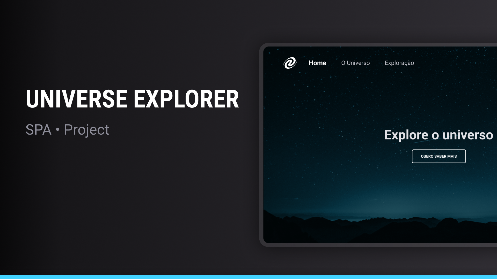

# 🌌 Universe Explorer

A Single Page Application (SPA) web app about the universe, developed to practice fundamental front-end routing concepts using pure JavaScript.



### 📋 About the Project

Universe Explorer is an SPA that allows users to navigate between different pages about the universe and space exploration without reloading the entire page. The project was developed as part of my front-end web development learning, with specific focus on:

- Implementing front-end routes without frameworks
- Manipulating browser navigation history
- Dynamic content loading via Fetch API
- Smooth transitions between pages

### 🚀 Technologies Used

- **HTML5** - Content structure
- **CSS3** - Styling and responsive layout
- **JavaScript** - Programming logic and DOM manipulation
- **Fetch API** - Asynchronous content loading
- **History API** - Navigation history manipulation
- **Lite-server** - Development server

## ✨ Features

- **Navigation** between pages without site reload
- **Dynamic** background changes according to the page
- **Visual** indication of current page in navigation
- **Responsive** layout for different devices
- **404** (Not Found) page handling

## 🧠 Applied Concepts

- **Single Page Application (SPA)**: Web application that interacts with users by dynamically rewriting the current page rather than loading new pages from the server.
- **Front-end Routing**: Managing navigation between different "pages" or application states without reloading the document.
- **History API**: Browser history manipulation to create a smooth navigation experience.
- **Modularization**: Organizing JavaScript code into modules for better maintenance and scalability.
- **Responsive CSS**: Interface adaptation for different screen sizes.

## 🔍 Project Structure

```
├── css/
│   └── style.css
├── images/
│   ├── mountains-universe-1.png
│   ├── mountains-universe-2.png
│   ├── mountains-universe-3.png
│   └── Vector.svg
├── js/
│   ├── active.js
│   ├── main.js
│   └── router.js
├── pages/
│   ├── 404.html
│   ├── exploration.html
│   ├── home.html
│   └── universe.html
├── index.html
└── package.json
...
```

## 🚀 How to Run the Project

1. Clone this repository:

   ```bash
   git clone https://github.com/seu-usuario/universe-explorer.git
   ```

2. Navigate to the project folder:

   ```bash
   cd universe-explorer
   ```

3. Install dependencies:

   ```bash
   npm install
   ```

4. Run the development server:

   ```bash
   npm start
   ```

5. Access the application in your browser:
   ```
   http://localhost:3000
   ```

## 📝 Learnings

During the development of this project, I learned and applied:

- How to implement a front-end routing system without relying on frameworks
- DOM manipulation to create a dynamic user experience
- Navigation state management using JavaScript
- CSS techniques for smooth page transitions
- Code organization in modules for better maintenance
